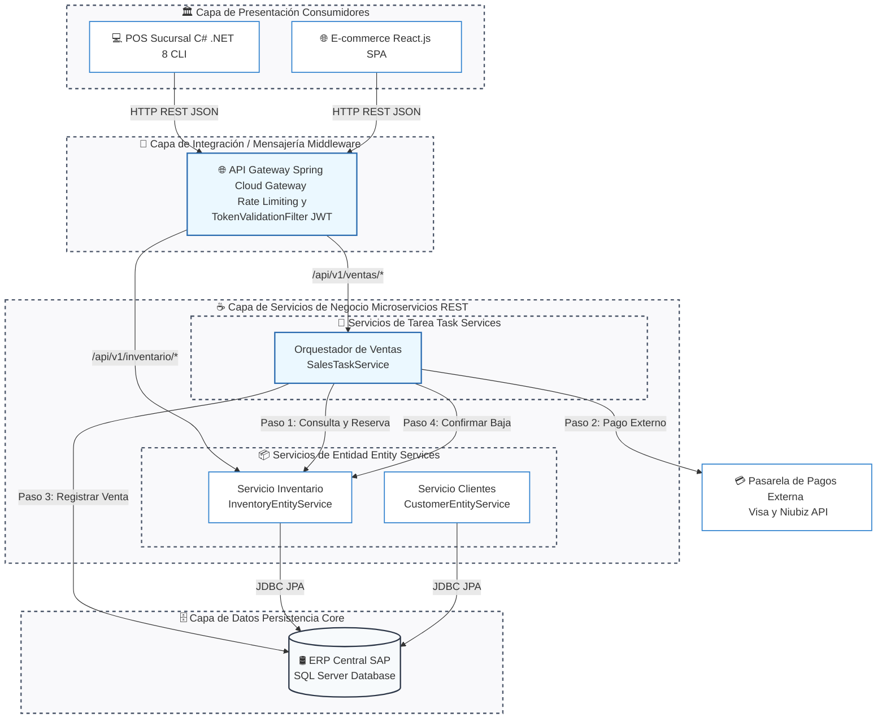
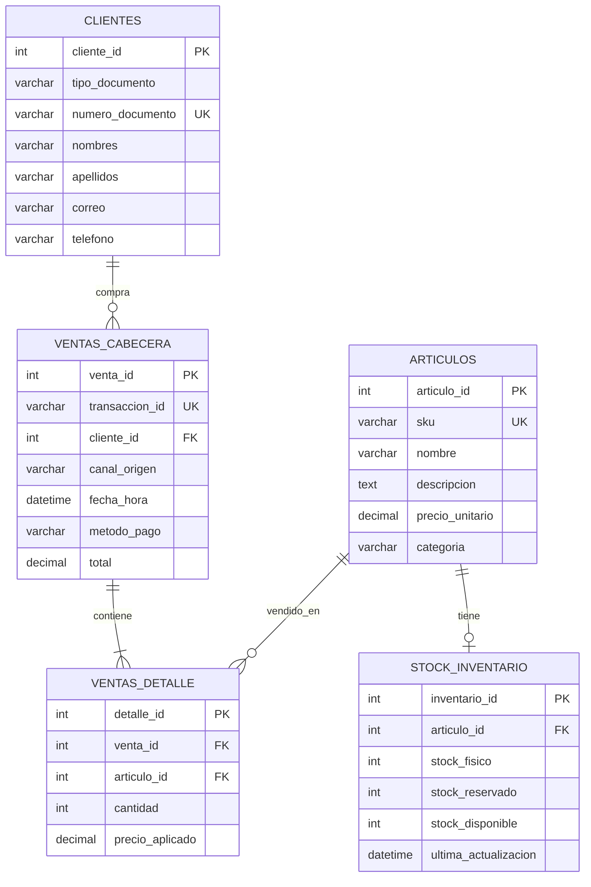
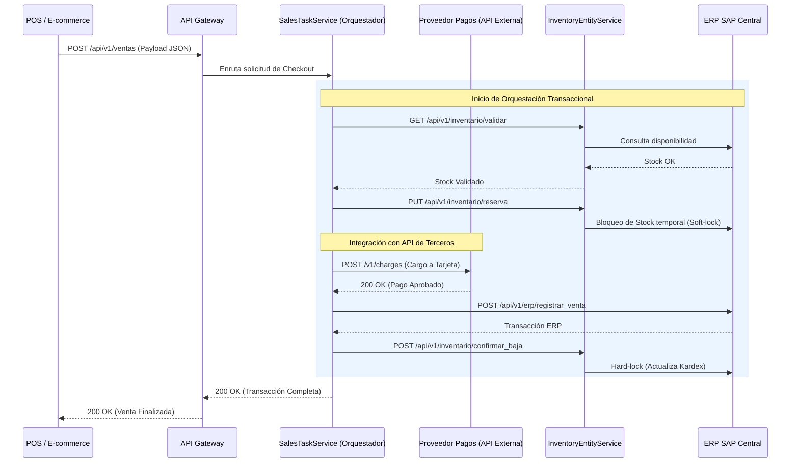

# 🚀 Proyecto InnovaTech: Arquitectura Orientada a Servicios (SOA)

> **Integración Omnicanal en Tiempo Real para Ventas e Inventario (ERP, POS y E-commerce)**  
> **Integrantes:** Yanac Caballero, Luis Enrique (U18127171) & Correa Guadalupe, Nelson Alfredo (U23256402)  
> **Curso:** Arquitectura Orientada al Servicio (SOA - UTP 2026-1)  
> **Docente:** Narro Andrade, Manuel Guillermo  
> **Repositorio de Desarrollo Corporativo**

---

## 🏛️ 1. Descripción del Proyecto y Visión Ejecutiva

El proyecto **InnovaTech SOA** tiene como objetivo erradicar de forma definitiva los silos de información transaccionales y geográficos de **InnovaTech Retail S.A.C.** 

### 🛑 La Problemática (AS-IS)
Actualmente, las 12 sucursales de tiendas físicas (POS en .NET C#) y el canal digital (E-commerce) operan de forma desconectada con el almacén central (ERP SAP en SQL Server). Al depender de **procesos por lotes (Batch) nocturnos** para cruzar saldos, se genera una latencia de 24 horas que provoca **"inventario fantasma"** (ventas duplicadas y quiebres de stock continuos).

### 🟢 La Solución (TO-BE)
Establecemos un modelo orientado a servicios interoperable, desacoplado y en tiempo real. Al centralizar las operaciones core a través de un **API Gateway** y un **Orquestador de Ventas**, logramos que cualquier transacción afecte el Kardex maestro de la empresa en el acto, logrando una consistencia financiera y logística omnicanal absoluta.

---

## 🌳 2. Estructura de Directorios del Repositorio

La arquitectura del proyecto está estructurada bajo principios puristas de codificación y desacoplamiento absoluto en los siguientes módulos:

```
InnovaTech_SOA/
├── .gitignore               # Exclusiones de Git para compilados de Java, .NET y Docker
├── README.md                # Documentación ejecutiva e instrucciones del proyecto
├── api-gateway/             # 🚦 Middleware: Spring Cloud Gateway (Java 17 / Spring Boot 3.x)
├── inventory-service/       # 📦 Entity Service: Microservicio de Inventario (Java 17 / JPA)
├── sales-orchestrator/      # 🎼 Task Service: Orquestador de Ventas (Java 17 / Orquestador síncrono)
├── pos-client/              # 💻 Consumidor POS: Punto de Venta en terminal (C# .NET 8)
└── infraestructura/         # 🐋 Docker Compose y scripts SQL para inicialización de la BD
    ├── docker-compose.yml   # Orquestador local de contenedores
    └── sql/
        └── schema.sql       # Creación de tablas de KardexSAP y semillas de datos iniciales
```

---

## 🚦 3. Modelo de Referencia SOA (Capas de la Arquitectura)

Para asegurar el cumplimiento de los principios SOA (bajo acoplamiento, neutralidad y reusabilidad), la arquitectura del software se rige por la siguiente separación de responsabilidades:



---

## 🛠️ 4. Stack Tecnológico Detallado

| Componente | Tecnología | Versión | Justificación Técnica |
| :--- | :--- | :--- | :--- |
| **Bases de Datos** | SQL Server (MSSQL) | 2022-latest | Motor relacional estándar corporativo del ERP SAP Business One. |
| **Microservicios (Backend)** | Java JDK | 17 (LTS) | Estándar empresarial para backend transaccional de alto rendimiento y resiliencia. |
| **Framework Backend** | Spring Boot | 3.2.x | Simplifica la inyección de dependencias y acelera la exposición de APIs RESTful. |
| **API Gateway** | Spring Cloud Gateway | 4.1.x | Middleware no bloqueante basado en WebFlux para ruteo de alto rendimiento. |
| **POS Consumidor (Sucursales)** | C# (.NET CLI) | .NET 8 (LTS) | Permite interactuar nativamente con hardware de caja física en terminal de forma ligera. |
| **E-commerce Consumidor** | React.js / Node.js | 18+ / 20+ | Framework de interfaz rápido y modular para el checkout del cliente digital. |
| **Orquestación de Entorno** | Docker / Compose | 3.8 | Garantiza portabilidad idéntica en desarrollo local y staging corporativo. |

---

## 🗄️ 5. Modelo de Datos Relacional (ERP SAP Central: `KardexSAP`)

La persistencia core reside en una única fuente de la verdad en SQL Server. El mapeo físico de los datos está diseñado en **Tercera Forma Normal (3FN)** para garantizar la integridad y auditoría de la facturación:



---

## 🎼 6. Flujo Transaccional de Orquestación (SalesTaskService)

Para evitar inconsistencias en el inventario o "sobreventas cruzadas", el checkout se gobierna de forma síncrona y atómica por el **Orquestador de Ventas**:


*(Nota: Si en el Paso 2 de pago externo ocurre un error o la pasarela rechaza la tarjeta, el Orquestador intercepta la excepción e invoca de forma automática una llamada de compensación (Rollback) para liberar el stock reservado en el Paso 1).*

---

## 📡 7. Catálogo de APIs y Contratos de Servicio (Endpoints)

Todas las comunicaciones a través de la frontera de integración consumen el puerto del Gateway (`80`).

### A. Inventory API (Entity Service)
*   **Consultar stock en tiempo real:**
    *   **GET** `/api/v1/inventario/{sku}`
    *   *Ejemplo de Respuesta (200 OK):*
        ```json
        {
          "sku": "TECH-LAP-001",
          "nombre": "Laptop Dell Latitude 5430",
          "stockDisponible": 25,
          "precioUnitario": 3200.00
        }
        ```
*   **Reserva de Stock (Soft-lock):**
    *   **PUT** `/api/v1/inventario/reserva`
    *   *Ejemplo de Petición (Payload):*
        ```json
        {
          "sku": "TECH-LAP-001",
          "cantidad": 1
        }
        ```

### B. Sales Orchestrator (Task Service)
*   **Checkout Omnicanal Stardardizado:**
    *   **POST** `/api/v1/ventas/checkout`
    *   *Ejemplo de Petición Canónica (Payload JSON):*
        ```json
        {
          "transaccionId": "TRX-202605-99881",
          "canalOrigen": "SUCURSAL_04_AREQUIPA",
          "cliente": {
            "tipoDocumento": "DNI",
            "numeroDocumento": "76543210"
          },
          "lineasArticulo": [
            {
              "sku": "TECH-LAP-001",
              "cantidad": 1,
              "precioUnitario": 3200.00
            }
          ],
          "metodoPago": "TARJETA_CREDITO"
        }
        ```
    *   *Ejemplo de Respuesta (200 OK):*
        ```json
        {
          "estado": "PROCESADO",
          "transaccionId": "TRX-202605-99881",
          "erpVentaId": 98223,
          "mensaje": "Venta cobrada e integrada en ERP SAP correctamente."
        }
        ```

---

## 📐 8. Principios y Patrones de Diseño SOA Aplicados

La robustez de InnovaTech radica en los patrones aplicados en la fase de análisis y diseño:

*   **Service Abstraction (Abstracción de Servicios):** Los consumidores (POS y Web) no conocen la base de datos de SQL Server ni el lenguaje backend; toda interacción se hace mediante contratos OpenAPI/REST.
*   **Service Reusability (Reusabilidad):** El `InventoryEntityService` es consumido tanto por el POS de sucursal como por el E-commerce React, eliminando código duplicado.
*   **Patrón Content-Based Router:** Implementado en el API Gateway para enrutar según la cabecera del URL (`/api/v1/inventario/**` hacia el microservicio de inventario).
*   **Patrón de Compensación (Rollback):** El orquestador de ventas ejecuta reversos HTTP para liberar reservas de stock ante fallos de pago bancario externo.
*   **Circuit Breaker (Tolerancia a fallos):** Implementado en el POS de C# usando `HttpClient` de forma no bloqueante: si el Gateway está caído, el POS activa el "Offline Mode" local para continuar facturando en caché sin paralizar la tienda física.

---

## 📋 9. Plan de Trabajo, Checklist y Roles (Roadmap Académico)

Para organizar las actividades de Nelson y Luis, se establece la siguiente distribución y avance del proyecto:

### Checklist de Implementación
- [ ] **Fase 1: Infraestructura y BD**
  - [x] Crear docker-compose.yml base y schema.sql *(Completado por Nelson)*
  - [ ] Levantar SQL Server local y poblar las tablas base *(Pendiente)*
- [ ] **Fase 2: Entity Services (Java Spring Boot)**
  - [ ] Configurar JPA en el `inventory-service` y exponer endpoints REST *(Nelson)*
  - [ ] Implementar el `customer-service` para validación de DNI *(Luis)*
- [ ] **Fase 3: API Gateway & Task Service (Java Spring Boot)**
  - [ ] Programar Spring Cloud Gateway con enrutamiento dinámico *(Nelson)*
  - [ ] Codificar el `SalesTaskService` con orquestación y reverso transaccional *(Luis)*
- [ ] **Fase 4: Consumidores y Pruebas en Vivo**
  - [ ] Crear el POS en C# (.NET 8 CLI) con HttpClient resiliente *(Nelson)*
  - [ ] Integrar el E-commerce con Axios hacia el endpoint de Inventario *(Luis)*
  - [ ] Pruebas finales de extremo a extremo e informe final *(Equipo)*

---

## 🚀 10. Guía de Inicialización del Entorno Local (Despliegue)

Para levantar la topología de base de datos de InnovaTech, asegurar el aislamiento en red y poblar la data inicial de prueba, sigue los siguientes pasos:

### Prerrequisitos
Asegúrate de contar con lo siguiente instalado en tu máquina local:
*   [Docker Desktop](https://www.docker.com/products/docker-desktop/)
*   [Visual Studio Code](https://code.visualstudio.com/)

### 🔌 Paso 1: Levantar el contenedor de Base de Datos
Abre tu terminal en la raíz de la carpeta `/infraestructura` y ejecuta:
```bash
docker-compose up -d sap-erp-db
```
*Este comando descargará la imagen oficial de SQL Server 2022 y la ejecutará exponiéndola en el puerto estándar `1433`.*

### ⚡ Paso 2: Inicializar las Tablas y Semillas (Seed Data)
Una vez que el contenedor de SQL Server esté activo, debes correr el script SQL de creación de base de datos e inyección de datos iniciales. Ejecuta la siguiente instrucción en tu terminal:
```bash
docker exec -i sap-erp-db /opt/mssql-tools18/bin/sqlcmd -S localhost -U sa -P "InnovaTech_2026!" -C -i /usr/config/schema.sql
```
*Este comando invocará el sqlcmd interno del contenedor e inicializará de forma automática las 5 tablas inyectando laptops, celulares, audífonos Sony, stock disponible y clientes de prueba.*

### 📦 Paso 3: Verificar la Conexión de Datos
Puedes conectarte a tu servidor SQL Server local utilizando la extensión de SQL Server de VS Code o Azure Data Studio usando las credenciales:
*   **Servidor:** `localhost,1433`
*   **Usuario:** `sa`
*   **Contraseña:** `InnovaTech_2026!`
*   **Base de Datos:** `KardexSAP`

---
*Este proyecto está estructurado bajo principios puristas de codificación. Toda la infraestructura se levanta y gestiona vía terminal para asegurar el dominio absoluto de la sintaxis y los protocolos de integración.*
